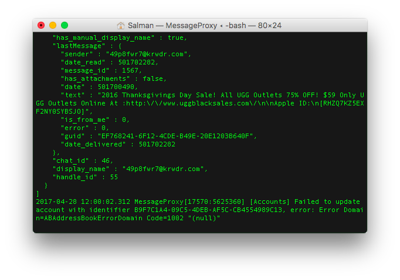
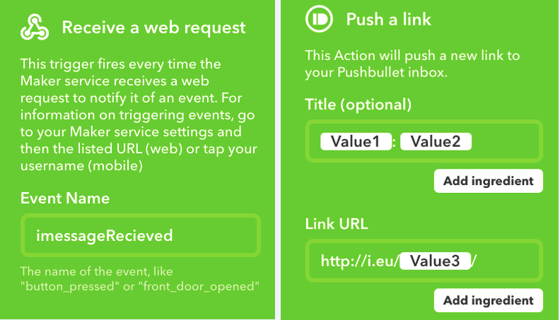

# MessageProxy: An Open Source iMessage API 

This API is primarily designed to be used with [AndromedaB (open source!)](https://github.com/shusain93/Andromeda-iMessage) however it is still possible to use independently. This project uses GCDWebserver for network requests. You can more or less deduce the API from the `ViewController.swift` in the code blocks. 

This setup reads the SQL database that the OSX iMessage app uses and so theoretically Apple will break it every time they update iMessage. Further, to send I am using keyboard shortcuts so you need both a sufficiently fast computer to be able handle UI automation (i.e. if it freezes all the time it'll be very unreliable). To combat the troubles of UI scripting, I have set it up to verify a message has been sent and if it fails it will notify over the notification setup your built in IFTTT. There are a few bugs in this: iOS 10 iMessage separates links at the start and end of your messages into brand new, separate ones and so the exact message text can't be found and so worst case scenario you end up accidentally spamming the same message 3 times and getting an error message back.

***You will need to run this on a computer which can act as a server and will never sleep***. If your server sleeps/goes offline not only will you not know about your texts, they will be delivered through iMessage and you won't be able to access any of them while you are away. If you get fired because my server failed create an issue and don't blame me.

### Features

1. Getting and sending messages
2. **GROUP CHATS!** This includes named and unnamed iMessage group chats (i.e. Person 1, person 2, person 3 AND "The Sushi Brigade")
3. Loading of attachments of any type. *todo:* allow sending!
4. A socket server so that clients can connect and get fast live message updates
5. Notify devices over IFTTT. *todo*: setup Firebase GCM

### Configuration/Setup!

To achieve notifications for the AndromedaB application I have setup IFTTT notifications through the maker API. You need to generate a token [here](https://ifttt.com/maker_webhooks). [Download the latest release](https://github.com/shusain93/OSXMessageProxy/releases). Download both the zip file and the latest `StartIMProxy.command` and move the unzipped application and the script into *a new folder somewhere other than where you unzipped the application* otherwise auto update doesn't work. Launch the application using the `StartIMProxy.command` (the script must be in the same folder as the application). Fill in your token from IFTTT and also add a protection key. This protection key is just a password/API key for your server so don't ever share it otherwise nasties can steal your messages! Keep the application in the same folder as `StartIMProxy.command` and don't rename the application without also first changing the script. You will use this short script (you can double click, may have to `chmod +x` it first) to launch and keep the server running all the time because it's not 100% perfect and still needs a watchdog to keep it alive 24/7. When you run the script (***never run through the app!***) you should see some text go by fast and then eventually `Ready at http://x.x.x.x:8735` in both the console and in the UI. If you see this, your server is running correctly however you still need to configure port forwarding ***for both ports (API server is by default 8375 and socket server is 8376, both TCP)*** and potentially a domain. You will need to accept the permissions request for contacts because otherwise you will have no names for anyone (duh)

Once you've got the server running, configure an IFTTT maker recipe with the event name as `imessageRecieved` (***note that this is spelled wrong, sorry. I spelled it the first time so now it's legacy***)

1. `Value1`: this is the from field
2. `Value2`: this is the message content
3. `Value3`: this is an advanced field which contains a search keyword which if included as the link field of a Pushbullet link push in the format `http://i.eu/{{Value3}}/` (copy and paste!) it will automatically launch the application to the correct conversation if clicked as a notification. http://i.eu will never resolve to anything (on char TLDs are banned) but it has the advantage of being very short so it won't take up much space in the notification tray. 

Here is an example configuration. You can set this up however you like but this works well for me (3739 times well)

### Building from source

This project uses Cocoapods and Swift Package Manager (sorry, the socket server is only available through SPM) but I have committed them to the repo so if you clone it should work directly. Launch the ***xcworkspace***. Xcode will give you an error about code sign most likely but that's not hard to fix. After you've done this, it should build successfully. You can make whatever changes you feel like however if you intend to keep any major modifications as this project develops you will need to make a fork of this project so you can merge changes.